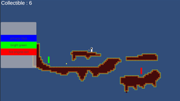

# Shifter
Plateformer 2D
Pistolet à peinture
Porte avec une serrure d'une couleur pour repeindre la porte si couleur débloquée / collectée
flaques avec buff / nerf

Fin -> Glissade sur peinture

## Tâche 2 - 10 Octobre
- Collectible (Teintures)
		- Art
		- Collectible
		- UI (Affichage compte)
- 3C
		- Character
		- Camera
		- Control

- Mechanic Principal

## Tâche 3 - 07 Novembre
- Build
- Menu Principal
- Menu Pause

## Tâche 4 - 14 Novembre
- Effets Sonores
- Système de particules
- Creative (Camera Shake)

##Tâche 5 - 28 Novembre
- Tutoriel

## IA Facile à compliquer
FSM - Finite State Machine
Behaviour Tree
GOAD -> to look but not implement
